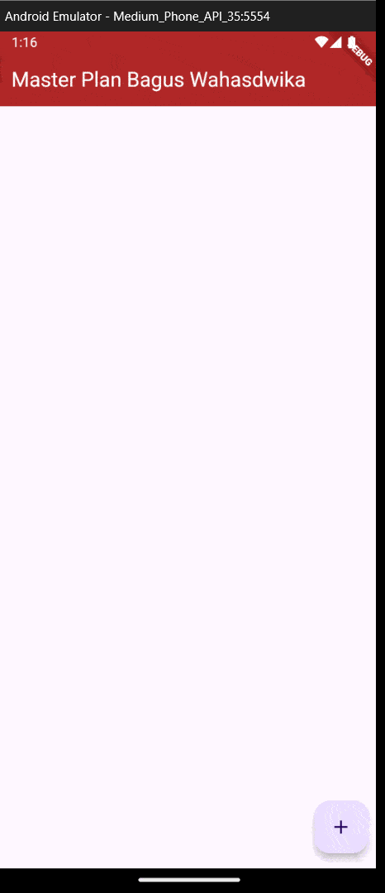

#### **Nama : Sukma Bagus Wahasdwika**

#### **NIM  : 2241720223**

# **Dasar State Management**

## Tugas Praktikum 1 : Dasar State dengan Model-View

#### 1. Selesaikan langkah-langkah praktikum tersebut, lalu dokumentasikan berupa GIF hasil akhir praktikum beserta penjelasannya di file README.md! Jika Anda menemukan ada yang error atau tidak berjalan dengan baik silakan diperbaiki.

- Selesai.

#### 2. Jelaskan maksud dari langkah 4 pada praktikum tersebut! Mengapa dilakukan demikian?

- Menyederhanakan Proses Impor: Dapat mengurangi jumlah baris kode yang diperlukan untuk impor dan membuat prosesnya lebih efisien.
- Memudahkan Pemeliharaan: Ketika aplikasi berkembang dan jumlah model bertambah, mengelola impor di berbagai file bisa menjadi rumit. Dengan memiliki satu file ekspor terpusat,hanya perlu memperbarui satu tempat jika ada perubahan pada model yang diekspor.
- Meningkatkan Keterbacaan Kode: Memiliki satu titik akses untuk semua model membuat kode lebih mudah dibaca dan dipahami.Pengembang lain dengan cepat menemukan dan mengimpor semua model yang diperlukan dari satu file.
- Struktur Modular: Setiap bagian kode memiliki tanggung jawab spesifik dan dapat dikelola secara terpisah. Meskipun kode dipecah menjadi file-file kecil, ekspor terpusat memastikan bahwa pengelolaan dan penggunaan modul-modul ini tetap mudah dan efisien.

#### 3. Mengapa perlu variabel plan di langkah 6 pada praktikum tersebut? Mengapa dibuat konstanta ?

- Variabel plan pada langkah 6 diperlukan untuk menyimpan data rencana yang akan digunakan dalam kelas _PlanScreenState. variabel plan diperlukan untuk menyimpan dan mengelola data rencana dalam aplikasi, dan dibuat sebagai konstanta untuk memastikan integritas data dan efisiensi kinerja.

#### 4. Lakukan capture hasil dari Langkah 9 berupa GIF, kemudian jelaskan apa yang telah Anda buat!

#### 5. Apa kegunaan method pada Langkah 11 dan 13 dalam lifecyle state ?

- Langkah 11: initState()
Metode initState() dipanggil sekali ketika objek state pertama kali dibuat. Ini adalah tempat yang tepat untuk melakukan inisialisasi yang hanya perlu dilakukan sekali, seperti mengatur listener atau menginisialisasi variabel.

- Langkah 13: dispose()
Metode dispose() dipanggil ketika objek state akan dihapus secara permanen dari widget tree. Ini adalah tempat yang tepat untuk membersihkan resource yang digunakan oleh state, seperti listener atau controller.

        * initState(): Digunakan untuk inisialisasi awal, seperti mengatur listener pada ScrollController.
        * dispose(): Digunakan untuk membersihkan resource ketika state tidak lagi diperlukan, memastikan tidak ada kebocoran memori.

## Tugas Praktikum 2 : InheritedWidget

#### 1. Selesaikan langkah-langkah praktikum tersebut, lalu dokumentasikan berupa GIF hasil akhir praktikum beserta penjelasannya di file README.md! Jika Anda menemukan ada yang error atau tidak berjalan dengan baik, silakan diperbaiki sesuai dengan tujuan aplikasi tersebut dibuat.

- Selesai

#### 2. Jelaskan mana yang dimaksud InheritedWidget pada langkah 1 tersebut! Mengapa yang digunakan InheritedNotifier?

- PlanProvider adalah turunan dari InheritedNotifier, yang pada dasarnya merupakan turunan dari InheritedWidget.

        Maka dari itu InheritedNotifier digunakan sebab:
        
- Efisiensi UI: Hanya widget yang terpengaruh yang diperbarui saat data berubah.
- Notifikasi Otomatis: Menggunakan ValueNotifier untuk mempermudah pemberitahuan perubahan data ke widget terkait.
- Pewarisan Data: Memudahkan distribusi data ke widget lain dalam pohon widget.

#### 3. Jelaskan maksud dari method di langkah 3 pada praktikum tersebut! Mengapa dilakukan demikian?

- Penambahan variabel plan sebagai atribut di dalam class PlanScreen dan menjadikannya parameter yang harus diisi melalui constructor. 
- Variabel plan digunakan untuk menampilkan atau mengelola detail data Plan di PlanScreen.

        Hal tersebut dilakukan karena,

- Penerusan Data: Memungkinkan PlanScreen menampilkan data spesifik dari objek Plan.
- Fleksibel: Membuat PlanScreen reusable untuk berbagai objek Plan.
- Terstruktur: Mengikuti pola data top-down yang jelas.

#### 4. Lakukan capture hasil dari Langkah 9 berupa GIF, kemudian jelaskan apa yang telah Anda buat!

- Membuat total jumlah dari baris yang ditambah dan total checkbox yang sudah dikonfirmasi atau centang. 

## Tugas Praktikum 3 : State di Multiple Screens

#### 1. Selesaikan langkah-langkah praktikum tersebut, lalu dokumentasikan berupa GIF hasil akhir praktikum beserta penjelasannya di file README.md! Jika Anda menemukan ada yang error atau tidak berjalan dengan baik, silakan diperbaiki sesuai dengan tujuan aplikasi tersebut dibuat.

- Selesai

#### 2. Berdasarkan Praktikum 3 yang telah Anda lakukan, jelaskan maksud dari gambar diagram berikut ini!

- Gambar diagram tersebut menjelaskan alur navigasi dan hierarki widget dalam aplikasi Flutter, yang terdiri dari dua layar utama: PlanCreatorScreen dan PlanScreen.

- PlanCreatorScreen bertugas untuk membuat rencana baru.
- PlanScreen bertugas untuk menampilkan rencana yang telah dibuat.

- Navigasi
Transisi antara PlanCreatorScreen dan PlanScreen dilakukan menggunakan Navigator.push. Ketika pengguna selesai membuat rencana di PlanCreatorScreen, mereka akan diarahkan ke PlanScreen untuk melihat hasilnya.

#### 3. Lakukan capture hasil dari Langkah 14 berupa GIF, kemudian jelaskan apa yang telah Anda buat!

implementasi state management menggunakan ValueNotifier, dimana perubahan data seperti penyelesaian tugas tercermin langsung dalam UI.
Fitur navigasi memungkinkan pengalaman pengguna yang interaktif dan dinamis, mendukung alur kerja pembuatan dan pengelolaan rencana.
Tampilan home ketika user dapat menambahkan beberapa list plan yang didalam plan tersebut diklik dapat menambahkan list tugas sesuai dengan plan yang dibuat pada tampilan pertama.

#### 4. Kumpulkan laporan praktikum Anda berupa link commit atau repository GitHub ke dosen yang telah disepakati !

